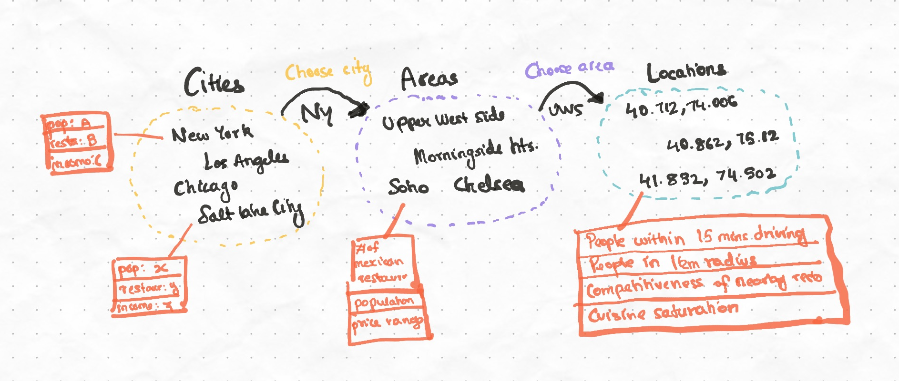

# Site Selection Case Study - Mexican Restaurants in the US 🌮

The demographic information in the Dotlas API is captured through the United States Census, and the restaurant information is available for upto 30 major cities. In this experiment, *we will take a top-down approach* in discovering a potential location for a mexican restaurant by using a *comparative analysis* - meaning we will measure the merits of cities, areas and locations against each other directly without performing heuristics.

Site selection (sometimes referred to as Suitability Analysis) is the process by which a physical location is selected for a business / organization. This is done by setting some constraints and optimizing against the goal of the location. For example, in the case of a restaurant - the location may need to be in close proximity to competing restaurants in order to divert / capture the already-existing market. The location may also seek to target areas with high average income and middle-aged demographics, or other customer attributes

In this case study, we will not be taking a complex approach that "estimates" the best location nor magically provides the best location for a restaurant in a city from scratch. We instead seek to take a systematic approrach of asking the data yes / no questions where we compare features at different levels and create a decision tree.

`city` -> `neighbourhoods` -> `exact coordinates`

